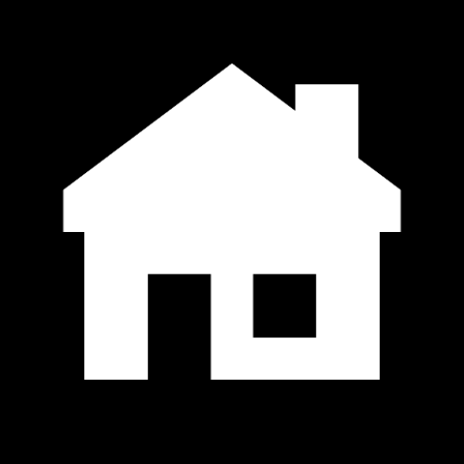

#  ⚡ Iteration Launcher

> **iOS-inspired interactions, Android-native elegance, Material 3 refined.**

[](https://kotlinlang.org/)
[](https://developer.android.com/jetpack/compose)
[](https://m3.material.io/)
[](https://opensource.org/licenses/MIT)
[](https://developer.android.com/)

**Iteration** is a high-performance, minimalist Android launcher built from the ground up using **Jetpack Compose**. It bridges the gap between fluid, intuitive UI patterns and the robust flexibility of the Android ecosystem. Designed for power users who value speed, aesthetics, and privacy.

---

## ✨ Key Features

### 🎨 Design & Interaction
*   **Immersive Edge-to-Edge**: Full transparency support that treats your wallpaper as the primary canvas.
*   **Icon Styles (New)**: Choose from 4 distinct presets:
    *   **Standard**: The classic look or Material You (M3) dynamic colors.
    *   **Black**: Deep midnight aesthetics. M3 mode features 20% tint backgrounds and neon-like foregrounds.
    *   **White**: Crisp and clean. White backgrounds with subtle M3 tints.
    *   **Glass**: Premium frost effect. M3 mode features tinted translucent bases with solid M3-colored foregrounds.
*   **Themed Icons (Material You)**: Standard-compliant dynamic icon tinting. Supports Android 13+ **Monochrome layers** and provides high-quality fallback for older versions.
*   **Glassmorphism Polish**: Icons and folders feature an ultra-fine (**0.5dp**) reflective border for enhanced depth.
*   **Notification Badges**: Real-time unread counts displayed as elegant badges on app icons.
*   **Fluid Pagination**: Smooth `HorizontalPager` transitions with a physics-based drag-and-drop system.
*   **Dynamic Preview Pages**: Drag apps to the edge in Edit Mode to intuitively "slide out" and create new desktop pages.
*   **Refined Motion**: UI elements like the Dock feature **Spring-physics** animations.
*   **Paged Folders (3x3 Grid)**: Organized folders with horizontal paging and real-time state synchronization.
*   **Jiggle Mode**: Long-press to enter edit mode with "jiggling" icons.
*   **Visual Polish**: System-wide icon corner radius refined to **105% (0.238f)**.

### 🧩 Widgets & Extensions (Minus One Page)
*   **Dynamic Theme Extraction**: Automatically extracts the dominant color from your wallpaper using **QuantizerCelebi** and **Score** algorithms.
*   **Smart Battery Widget**: Real-time monitoring with a circular progress indicator.
*   **Analog Clock Widget**: Minimalist clock with synchronized second-hand animations and dynamic M3 coloring.
*   **Standard Calendar Widget**: A 2x2 widget showcasing the current date and day.
*   **Wide Calendar Widget (4x2)**: Displays upcoming system calendar events in a detailed list (Requires Permission).
*   **Interactive Photo Widgets**: Supports **2x2 (Standard)** and **4x2 (Wide)** formats with a built-in cropping tool.

### 🔍 Discovery & Organization
*   **Usage-based Suggestions**: Intelligently learns and displays your **4 most frequent apps**.
*   **Global Search Hub**: A unified search interface (swipe-down) indexing apps and web results.
*   **Smart Categorization**: Automatic grouping of applications using Android's native metadata.
*   **Custom Category Management**: Create, delete, and reorder categories.
*   **App Re-categorization**: Manually assign any app to your custom categories.

### 🔒 Privacy & Personalization
*   **Secure Vault**: Hide sensitive applications behind a password-protected layer.
*   **Deep Customization**: 
    *   **Pro Icon Re-skinning**: High-resolution (512px) icon cropping with precision `Matrix` transformations.
    *   **Alias Management**: Rename applications to fit your personal aesthetic.
*   **Backup & Restore**: Export/Import your entire configuration (layout, custom icons, labels, categories) via JSON.

---

## 🛠️ Technical Showcase

### High-Performance Rendering
*   **Multi-Layer Icon Processing**: Decouples icon fetching, processing (tinting/masking), and caching.
*   **Advanced Three-Level Caching**: 
    *   **Memory (LruCache)**: Instant access to recently used `ImageBitmaps`.
    *   **Color-Aware Disk Cache**: Persistent cache for processed icons. Filenames are keyed by **PackageName + Style + PrimaryColorHex**, ensuring instant updates when wallpaper or styles change.
*   **ProGuard/R8 Optimized**: Custom rules to preserve ViewModel constructors, Data Models, and Enum logic, ensuring a crash-free **Release APK** experience.
*   **Optimized Recomposition**: Leverages stable `keys` and `remembered` states.

### Architecture (MVVM)
- **ViewModel + StateFlow**: Reactive UI updates driven by a single source of truth.
- **Repository Pattern**: Separation between Package Manager interactions and UI logic.
- **Data Persistence**: 
    *   `SharedPreferences`: Lightweight settings and layout serialization.
    *   `Internal Files`: Binary storage for custom cropped icons and widget photos.

---

## 📦 Project Structure

```text
app/src/main/java/com/liferlighdow/iteration/
├── MainActivity.kt        # Entry point, Desktop (Pager), Dock, & App Library
├── MainViewModel.kt       # State machine, layout logic, and data orchestration
├── AppRepository.kt      # System package querying and metadata extraction
├── AppModel.kt           # Domain models for Apps, Folders, and Widgets
├── IconProcessor.kt      # Complex bitmap manipulation & M3 tinting logic
├── IconStyle.kt          # NEW: Style definitions (Standard, Black, White, Glass)
├── SettingsActivity.kt    # Preferences, Customization UI, & Backup Tools
└── NotificationService.kt # Background listener for real-time app badges
```

---

## 🔑 Permissions
- **Query All Packages**: Necessary to list and launch installed applications.
- **Notification Listener**: Required to display unread badges on app icons.
- **Read External Storage**: Required for custom icons and photo widget images.
- **Read Calendar**: Required for the Calendar widget (Optional).

---

## 📜 License
Licensed under the **MIT License**.

---

**Developed with ❤️ by Lifer_Lighdow**
